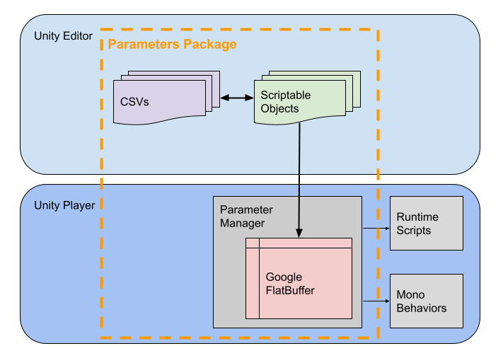
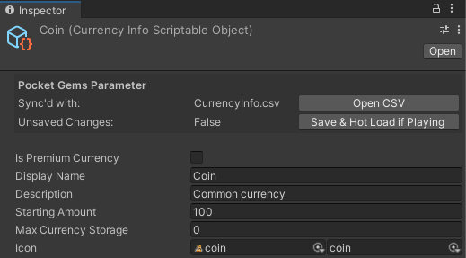
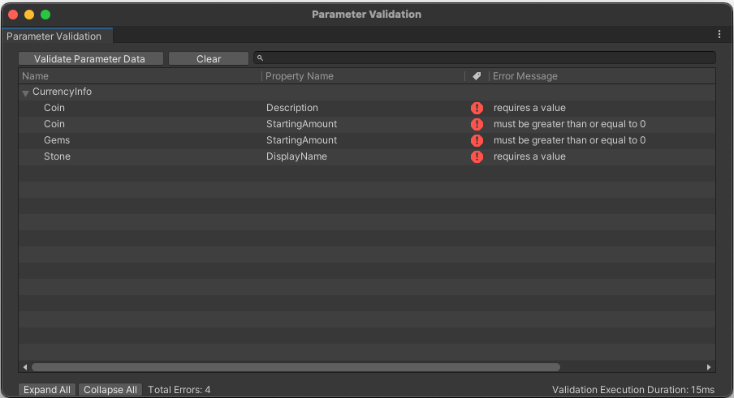
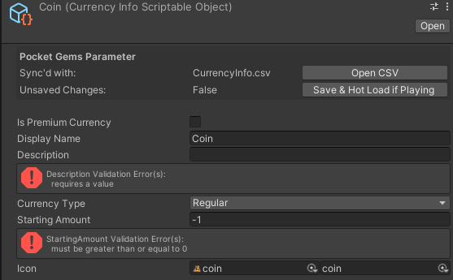

# Scriptable Object - FlatBuffer <!-- omit in toc -->

- [About](#about)
- [Features](#features)
  - [Define Data Types](#define-data-types)
  - [Content Workflow](#content-workflow)
  - [Generated Asset](#generated-asset)
  - [Querying Data](#querying-data)
  - [Data Validation](#data-validation)
- [Documentation](#documentation)

# About
The package streamlines data synchronization between [Scriptable Objects](https://docs.unity3d.com/Manual/class-ScriptableObject.html) and CSVs.  It automatically packages the data into [Google FlatBuffers](https://flatbuffers.dev/) for runtime use for fast loading and reduced memory footprint.  A data validation workflow is provided to enforce and maintain the integrity of data and its interrelationships.

**Benefits**
- Allows bulk modifications through CSVs or fine-turning of entities through the [Scriptable Object inspector](https://docs.unity3d.com/Manual/UsingTheInspector.html).
- Runtime advantages of [Google FlatBuffers](https://flatbuffers.dev/flatbuffers_benchmarks.html) without imposing the complexities associated with the conventional [FlatBuffer workflow](https://flatbuffers.dev/flatbuffers_guide_tutorial.html).
  - No overhead of runtime deserializing of Scriptable Objects.
  - Compressed de-duplicated data in memory.
- Auto data validation of generated runtime data & during inspector edit time.



# Features

## Define Data Types
Define a Scriptable Object or struct by creating an interface.

```c#
public interface ICurrencyInfo : IBaseInfo
{
    bool IsPremiumCurrency { get; }
    LocalizedString DisplayName { get; }
    LocalizedString Description { get; }
    short StartingAmount { get; }
    AssetReferenceSprite Icon { get; }
}
```

## Content Workflow
Create & modify Scriptable Objects in editor.



Or modify in bulk using the sync'd CSV(s).

| Identifier | IsPremiumCurrency | DisplayName     | Description     | StartingAmount | Icon                                  |
| ---------- | ----------------- | --------------- | --------------- | -------------- | ------------------------------------- |
| string     | bool              | LocalizedString | LocalizedString | short          | AssetReferenceSprite                  |
| Coin       | 0                 | Coin            | Common currency | 100            | 4c36500ce4684478781316054b5e16d6-coin |
| Gems       | 1                 | Gem             | Shiny!          | 50             | -                                     |
| Lumber     | 0                 | Lumber          | Chop chop chop  | 10             | -                                     |
| Stone      | 0                 | Stone           | I'm a Stone     | 20             | -                                     |

## Generated Asset
A `Parameter.bytes` asset is automatically generated for runtime use and can be loaded through `Resources` or as an `Addressable` asset.

## Querying Data
Streamlined API for inline data retrieval.

```c#
# get a specific currency item
ICurrencyInfo coinInfo = Params.Get<ICurrencyInfo>("Coin");
if (coinInfo != null)
{
  bool isPremiumCurrency = coinInfo.IsPremiumCurrency;
  // ...
}

# iterate over all CurrencyInfos
IEnumerable<ICurrencyInfo> currencyInfos = Params.Get<ICurrencyInfo>();
foreach (ICurrencyInfo info in currencyInfos)
{
  Debug.Log($"{info.Name}: {info.StartingAmount}")
}
```

## Data Validation
Validation window to see all failed checks.



Inspector support for on-the-fly validation.



Quickly add validation with attributes.
```c#
public interface ICurrencyInfo : IBaseInfo
{
    bool IsPremiumCurrency { get; }

    [AssertStringNotEmpty]
    LocalizedString DisplayName { get; }

    [AssertStringNotEmpty]
    LocalizedString Description { get; }

    [AssertGreaterOrEqual(0)]
    short StartingAmount { get; }

    AssetReferenceSprite Icon { get; }
}
```

Support to implement custom validations as required.
```c#
protected override void ValidateInfo(IParameterManager parameterManager, ICurrencyInfo info)
{
  if (info.IsPremiumCurrency && string.IsNullOrEmpty(info.PremiumCurrencyIconSprite.AssetGUID))
    Error(nameof(ICurrencyInfo.PremiumCurrencyIconSprite), "required for premium currency");
}
```

# Documentation
1. [One Time Setup](README/Setup.md): Guide for initial project configuration and code bootstrapping.
1. [Defining Data Types](README/DefiningDataTypes.md): Instructions to define and adjust data types.
   1. [Interfaces & Enums](README/InterfacesAndEnums.md): Specifics about defining interfaces & enums.
1. [Content Workflow](README/ContentWorkflow.md): Process for creating and modifying data using CSVs or Scriptable Objects.
1. [Generated Asset](README/GeneratedAsset.md): Details about the asset that holds the auto generated parameter data.
1. [Querying Data](README/QueryingData.md): Techniques and guidelines for querying data at runtime.
1. [Data Validation](README/DataValidation.md): Establish rules and criteria for ensuring data integrity.
   1. [Validation Attributes](README/ValidationAttributes.md): All valid attributes for validation use.
1. [Troubleshooting](README/Troubleshooting.md)

---

This README follows the structure of  [Make a README](https://www.makeareadme.com/).
