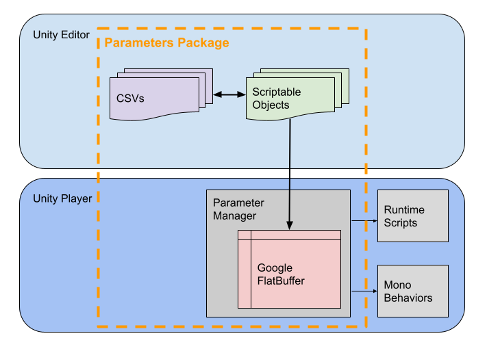
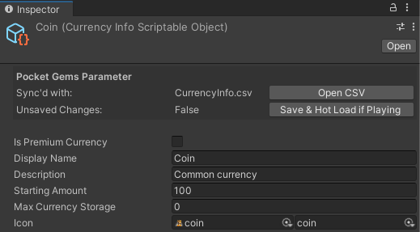
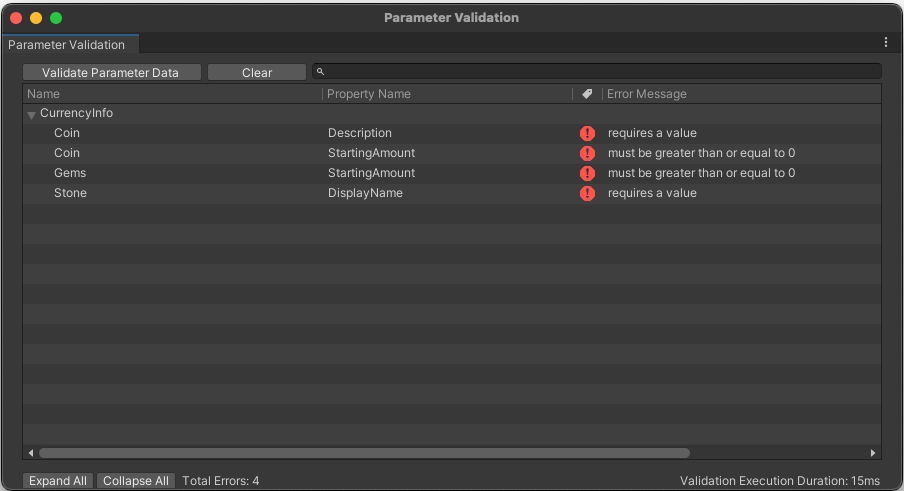
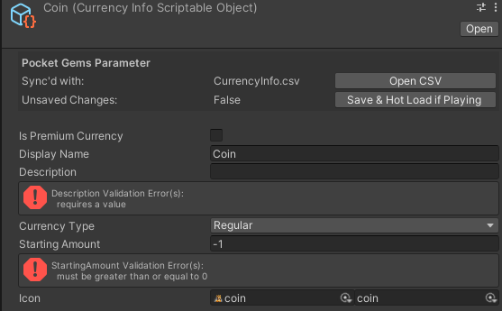

# Scriptable Object - FlatBuffer <!-- omit in toc -->
- [About](#about)
- [Features](#features)
  - [Define Data Types](#define-data-types)
  - [Content Workflow](#content-workflow)
  - [Generated Asset](#generated-asset)
  - [Querying Data](#querying-data)
  - [Data Validation](#data-validation)
- [Documentation](#documentation)

# About
This package streamlines data synchronization between [Scriptable Objects](https://docs.unity3d.com/Manual/class-ScriptableObject.html) and CSVs. It automatically packages data into [Google FlatBuffers](https://flatbuffers.dev/) for fast loading and reduced memory usage. Built-in validation workflows enforce data integrity and relationship consistency.

**Benefits**
- **Flexible Workflow:** Bulk edit via CSV or fine-tune entities using the [Scriptable Object inspector](https://docs.unity3d.com/Manual/UsingTheInspector.html).
- **High Performance:** Leverage [Google FlatBuffers](https://flatbuffers.dev/flatbuffers_benchmarks.html) without typical [implementation complexities](https://flatbuffers.dev/flatbuffers_guide_tutorial.html).
  - Zero runtime deserialization overhead as opposed to ScriptableObjects.
  - Memory-efficient, deduplicated string storage.
- **Robust Integrity:** Automatic data validation of generated data and Inspector editing.



# Features
## Define Data Types
Define ScriptableObject and/or serialized Structs using C# interfaces.
```c#
public interface ICurrencyInfo : IBaseInfo
{
    bool IsPremiumCurrency { get; }
    LocalizedString DisplayName { get; }
    LocalizedString Description { get; }
    short StartingAmount { get; }
    AssetReferenceSprite Icon { get; }
}
```

## Content Workflow
Create and modify Scriptable Objects directly in the Editor.



Alternatively, generate CSVs on demand (`Pocket Gems` → `Parameters` → `Generate CSVs`) and edit them for bulk editing; changes sync back to the Scriptable Objects.

| Identifier | IsPremiumCurrency | DisplayName     | Description     | StartingAmount | Icon                                  |
| ---------- | ----------------- | --------------- | --------------- | -------------- | ------------------------------------- |
| string     | bool              | LocalizedString | LocalizedString | short          | AssetReferenceSprite                  |
| Coin       | 0                 | Coin            | Common currency | 100            | 4c36500ce4684478781316054b5e16d6-coin |
| Gems       | 1                 | Gem             | Shiny!          | 50             | -                                     |
| Lumber     | 0                 | Lumber          | Chop chop chop  | 10             | -                                     |
| Stone      | 0                 | Stone           | I'm a Stone     | 20             | -                                     |

## Generated Asset
The system automatically generates a `Parameter.bytes` asset for runtime use, loadable via `Resources` or `Addressables`.

## Querying Data
Retrieve data efficiently using a streamlined API.

```c#
# get a specific currency item
ICurrencyInfo coinInfo = Params.Get<ICurrencyInfo>("Coin");
if (coinInfo != null)
{
  bool isPremiumCurrency = coinInfo.IsPremiumCurrency;
  // ...
}

# iterate over all CurrencyInfos
IEnumerable<ICurrencyInfo> currencyInfos = Params.Get<ICurrencyInfo>();
foreach (ICurrencyInfo info in currencyInfos)
{
  Debug.Log($"{info.Name}: {info.StartingAmount}")
}
```

## Data Validation
View failed checks in the dedicated Validation Window.



Receive real-time feedback via Inspector validation.



Apply validation rules using attributes.

```c#
public interface ICurrencyInfo : IBaseInfo
{
    bool IsPremiumCurrency { get; }

    [AssertStringNotEmpty]
    LocalizedString DisplayName { get; }

    [AssertStringNotEmpty]
    LocalizedString Description { get; }

    [AssertGreaterOrEqual(0)]
    short StartingAmount { get; }

    AssetReferenceSprite Icon { get; }
}
```

Implement custom validation logic where necessary.

```c#
protected override void ValidateInfo(IParameterManager parameterManager, ICurrencyInfo info)
{
  if (info.IsPremiumCurrency && string.IsNullOrEmpty(info.PremiumCurrencyIconSprite.AssetGUID))
    Error(nameof(ICurrencyInfo.PremiumCurrencyIconSprite), "required for premium currency");
}
```

# Documentation
1. [One Time Setup](README/Setup.md): Project configuration and bootstrapping.
1. [Defining Data Types](README/DefiningDataTypes.md): Defining and adjusting data types.
   1. [Interfaces & Enums](README/InterfacesAndEnums.md): Specifics on interfaces and enums.
1. [Content Workflow](README/ContentWorkflow.md): Creating and modifying data (CSV vs. Inspector).
1. [Generated Asset](README/GeneratedAsset.md): Details on the auto-generated parameter asset.
1. [Querying Data](README/QueryingData.md): Runtime data retrieval techniques.
1. [Data Validation](README/DataValidation.md): Rules for ensuring data integrity.
   1. [Validation Attributes](README/ValidationAttributes.md): List of available attributes.
1. [String Localization](README/Localization.md): Localizing user-facing strings.
2. [Troubleshooting](README/Troubleshooting.md)

---

This README follows the structure of [Make a README](https://www.makeareadme.com/).
