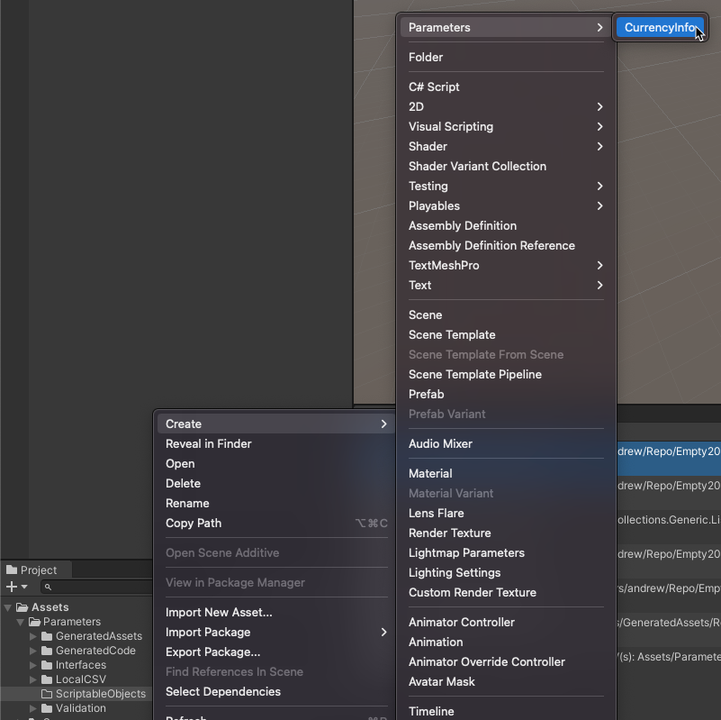
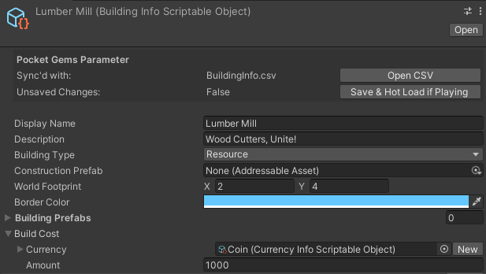
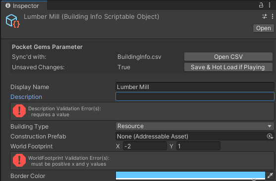
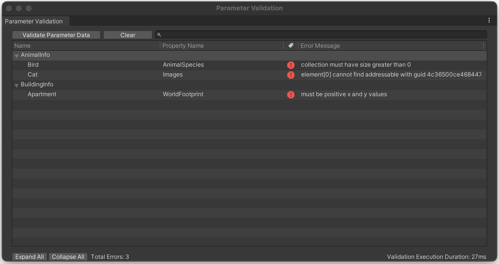

# Content Workflow <!-- omit in toc -->

- [Create](#create)
  - [Folder Structure](#folder-structure)
- [Modify](#modify)
  - [Editor](#editor)
  - [Editor Runtime](#editor-runtime)
  - [CSV Tool](#csv-tool)
    - [Scriptable Object](#scriptable-object)
    - [Struct](#struct)
- [Data Validation](#data-validation)
  - [Inspector](#inspector)
  - [Window](#window)
- [Source Control](#source-control)


## Create
Create a new Scriptable Object as you’d do in Unity.  This example creates the Scritpable Object through the Project window with a right click.


It is recommended that Scriptable Objects live under the `Assets/Parameters/ScriptableObjects` folder as subfolders.  However, the Scriptable Objects can live anywhere in the project under the `Assets/` folder.

### Folder Structure
All associated folders & files will be located under `Assets/Parameters/`.

```bash
Assets/
├─ Parameters/
│  ├─ ScriptableObjects/
│  │  ├─ Currency/
│  │  │  ├─ coin.asset
│  │  │  ├─ diamond.asset
│  │  │  ├─ wood.asset
│  │  ├─ Buildings/
│  │  ├─ Events/
│  │  ├─ ValuePacks/
```

## Modify
There are a few avenues for modifying the data.

### Editor
In the editor, these Scriptable Objects can be modified via the inspector like any other Unity asset.  Usually, Scriptable Objects must be manually saved (Command + s shortcut) for Unity to write to disk.  An [inspector tool](Editor/Editor/InspectorAutoSave.cs) automatically auto saves the Scriptable Object after a delay after the last modification was made to reduce friction.



The package managed Scriptable Objects can be identified with the custom inspector options at the top:

**Pocket Gems Parameter**
-  *Open CSV*: Opens the respective CSV that this Scriptable Object is sync'd with.
-  *Save & Hot Load if Playing*: If making modifications while the Unity Editor is playing, this button saves changes to this Scriptable Object and hot loads the changes into the current running app.

### Editor Runtime
The Scriptable Objects can be modified at editor runtime for live debugging and tweaks.  The changes will take when the Scriptable Object is saved (see above).

### CSV Tool
For ease of editing Scriptable Objects bulk, the Scriptable Objects are sync'd to CSV files upon Unity asset import.  If a change is made in a CSV, the change will automatically be applied to the Scriptable Object upon the Unity application regaining focus in the operating system.  The reverse direction is also true - changes to Scriptable Objects will be reflected in the CSVs.

**Example Folder Structure**

The CSV files will be located under the `Assets/Parameters/LocalCSV` folder.  These CSV files are local only and are ignored by source control.

```bash
Assets/
├─ Parameters/
│  ├─ LocalCSV/
│  │  ├─ CurrencyInfo.csv
│  │  ├─ BuildingInfo.csv
│  │  ├─ EventInfo.csv
│  │  ├─ ValuePackInfo.csv
│  │  ├─ RewardStruct.csv
│  ├─ ScriptableObjects/
│  │  ├─ Currency/
│  │  ├─ Buildings/
│  │  │  ├─ House.asset
│  │  │  ├─ Lumber.asset
│  │  │  ├─ StoneQuarry.asset
│  │  ├─ Events/
│  │  ├─ ValuePacks/
```

#### Scriptable Object

This is an example generated CSV located at `Assets/Parameters/LocalCSV/BuildingInfo.csv`.
> 🛑 The last two columns are used for book keeping and should not be modified.

|	Identifier	|	DisplayName	|	Description	|	WorldFootprint	|	BuildCost	|	BuildingType	|	CurrencyGenerationDurationSeconds	|	GeneratedCurrency	|	Metadata	|	e388be7082ddf6627ab156036f6a8ec6	|
|	---------	|	---------	|	---------	|	---------	|	---------	|	---------	|	---------	|	---------	|	---------	|	---------	|
|	string	|	LocalizedString	|	LocalizedString	|	Vector2	|	int	|	BuildingType	|	int	|	ICurrencyInfo	|	string	|	ec9e228de4b660f81716f20e6362e4d4	|
|	House	|	2 Story House	|	I'm a House!	|	2,2	|	100	|	House	|	50	|	Coin	|	e22d5d1d7f42342c28dae1d3895ae263	|	86bf014d0ccc6f9945b9b57e1cbefa4b	|
|	LumberMill	|	Lumber Mill	|	I create lumber for you!	|	3,4	|	100	|	Warehouse	|	100	|	Lumber	|	106fdd3e35b0c4fe98939706722f02e7	|	789958d8b1f2ae65775561b59bdc3c3a	|
|	StoneQuarry	|	Stone Quarry	|	I make stone!	|	3,3	|	200	|	Warehouse	|	20	|	Stone	|	cb9fa6f3d65b34d5cb8220e5da8dfe08	|	e41566bc4bb277a68281a83723d1cfa2	|

Functionality
- Creating
  - Creating new rows will create new Scriptable Objects.
- Deleting
  - Deleting existing rows will delete Scriptable Objects.
- Warning: If you delete a row and re-create it again with the same identifier, all `ParameterReferences` to the original asset will be lost.  This is the same behavior as deleting a ScriptableObject & creating it again in Unity.  All previous references to the old GUID will be lost.
- `ICurrencyInfo` refrences the `CurrencyInfo` scriptable object with the identifier (Name) of the Scriptable Object.  The identifier is displayed for readability instead of what's actually serialized (the GUID).
- Address References display the GUID.  Assign address reference in the Unity Editor Scriptable Object inspector directly to prevent address typing mistakes.
- There is a convenience menu item to open the csv folder under:  `Pocket Gems` --> `Parameters` --> `Open CSV Folder`.

#### Struct

Structs serialized in Scriptable Objects are also sync'd to their own individual CSVs to better represent the nesting nature of Structs.

This is an example generated CSV located at `Assets/Parameters/LocalCSV/RewardStruct.csv`.
> 🛑 The last columns is used for book keeping and should not be modified.

The CSV hold all Structs across all Scriptable Object types organized by Keypath.

| Currency |	Amount	| Metadata	| 864bfe2e2b02b0f0574e6be641f9915d| 
|	---------	|	---------	|	---------	|	---------	|
| ICurrencyInfo |	int |	7bc7292cb988c5e8a33a23b3227c1eb0 |	688da6f1c7c68e2a3d00dbdc4463ffab|
| Coin|	100|	BuildingInfo[Apartment].BuildCost	|c0b84b5c4a87f0a7db039bc74b5b4bf9|
|Lumber	|20	|BuildingInfo[House].BuildCost	|8622c7bd40ea73d37d0654649022802b|
|Coin	|1000	|BuildingInfo[LumberMill].BuildCost	|e9ec3cd1e3455f2e35fcb8e999e5c545|
|Coin	|1500	|BuildingInfo[StoneQuary].BuildCost	|d78db36db514b104b90a64364f1bf900|
|Coin	|100|	EventInfo[BattleEvent].EventCompletionRewards.Transactions[0]|	1230743f725a2a51b7a76f465ba41cbc |
|Gems	|10	| EventInfo[BattleEvent].EventCompletionRewards.Transactions[1]	|49632a6f492751dc3b499b340c95d26a|
| Lumber |	10|	EventInfo[BattleEvent].EventCompletionRewards.Transactions[2]	|5a3bcc208e19277025980e795fad8438|
|Coin	| 1000|	EventInfo[CarnivalEvent].EventCompletionRewards.Transactions[0]	|725a84e587f24101877e380e75d2716a|
|Stone	| 10|	EventInfo[PvPEvent].EventCompletionRewards.Transactions[0]	|89e8e6487fe4fac3950e8f7256bb8fae|


GUID Column
- The `Metadata` column describes the KeyPath of where the struct lives.
- Example: `BuildingInfo[Apartment].BuildCost`
  - This struct exists in the `BuildingInfo` with identifier `Apartment`
  - The property named `BuildCost` is defined this typed of Struct.
- Example: `EventInfo[BattleEvent].EventCompletionRewards.Transactions[0]` 
  - This struct exists in the `EventInfo` with identifier `BattleEvent`
  - The struct is in an array of structs in the property `Transactions` at index `0`.
  - This struct is nested in another Struct through the property `EventCompletionRewards`.

Functionality
- Creating
  - New structs can only be created if they are adding to an array of structs.
  - Ensure that the indexes of structs in this array are contiguous.  If there is a missing index inbetween indexes, an error will be thrown.
    - Valid Example 
      - `EventInfo[BattleEvent].EventCompletionRewards.Transactions[0]` 
      - `EventInfo[BattleEvent].EventCompletionRewards.Transactions[1]` 
      - `EventInfo[BattleEvent].EventCompletionRewards.Transactions[2]` 
    - Invalid Example 
      - `EventInfo[BattleEvent].EventCompletionRewards.Transactions[0]` 
      - `EventInfo[BattleEvent].EventCompletionRewards.Transactions[3]` 
      - `EventInfo[BattleEvent].EventCompletionRewards.Transactions[5]` 
- Deleting
  - Structs can only be deleted if they are part of an array.  
  - Otherwise, deleting an existing row will re-populate with default struct values.

## Data Validation
If data violates any pre-built validation rules, user facing prompts will display to notify the developer.

See [Building Data Types](#building-data-types) for more details about adding these rules.

### Inspector
In the inspector, real time errors will show below fields that are violating pre-built validation rule(s).


### Window
If there are errors when generating all of the data, a Parameter Validation window will open and display all errors.  Clicking on each of the errors will select the appropraite Scriptable Object in the project window and focus the inspector on it.  If there isn't a specific Scriptable Object for an error, the CSV file will be highlighted.


This window can be manually opened, through the menu `Pocket Gems` --> `Parameters` --> `Validation Window`.  Validation can be ran with the `Validate Parameter Data` button on the window.

## Source Control
Scriptable Objects are source controlled.  Any modifications made should be committed and merged.  CSVs are a local copy and are not source controlled.

```bash
	modified:   Assets/Parameters/ScriptableObjects/House.asset
	modified:   Assets/Parameters/ScriptableObjects/LumberMill.asset
	modified:   Assets/Parameters/ScriptableObjects/StoneQuarry.asset
```