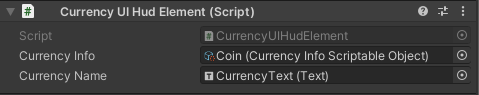

# Querying Data <!-- omit in toc -->
There are multiple methods to query data during runtime.

- [Get By Reference](#get-by-reference)
- [Get By Identifier](#get-by-identifier)
- [Get All By Type](#get-all-by-type)
- [Get Struct](#get-struct)
- [Querying Parameters In Editor](#querying-parameters-in-editor)

## Get By Reference
Traditionally Scriptable Objects are referenced directly in fields (e.g. `CurrencyScriptableObject currency;`).  Instead, parameters must be referenced in the editor using the `ParameterReferences<>` type fields.  This can be utilized in MonoBehaviors as well as other Scriptable Objects.



These fields can be referenced in code through the `Info` property.  The `Info` property returns `null` if the reference was deleted or never assigned.
```c#
public class CurrencyUIHudElement : MonoBehaviour
{
  // assigned currency scriptable object through the editor
  [SerializeField] private ParameterReference<ICurrencyInfo> currencyInfo;
  public Text currencyName;

  private void Awake()
  {
    // fetch the Info and then DisplayName & text from it.
    currencyName.text = currencyInfo.Info.DisplayName.Text;
  }
}
```

## Get By Identifier
To fetch a particular object by identifier, use the `Params.Get<T>(string identifier)` API.
```c#
// fetch a currency info by identifier,
ICurrencyInfo currencyInfo = Params.Get<ICurrencyInfo>("Coin");
// null if it doesn't exist
if (currencyInfo != null)
  int initialAmount = currencyInfo.InitialAmount;
```

Fetching a particular object can be searched with it's direct interface or a super interface.
```c#
// example sub interface
public interface IEventCurrencyInfo : ICurrencyInfo
{
  float EventDropRate { get; }
}
```

```c#
// If a Scriptable Object for EventCurrencyInfo was created
// with name "event_coin", both of these calls will return the same object.
ICurrencyInfo info = Params.Get<ICurrencyInfo>("event_coin");
IEventCurrencyInfo eventInfo = Params.Get<IEventCurrencyInfo>("event_coin");
```
> ⚠️ Note: Identifiers must be unique across all instances derived from a common super interface.

## Get All By Type
To get all objects of a particular type, utilize the `Params.Get<T>()` API.  This does not return objects in any particular order.
```c#
IEnumerable<ICurrencyInfo> currencyInfos = Params.Get<ICurrencyInfo>();
foreach (ICurrencyInfo currencyInfo in currencyInfos)
{
  // do things with currencyInfo
}
```

Fetching all objects of a type returns all sub interfaces as well.
```c#
// example sub interface
public interface IEventCurrencyInfo : ICurrencyInfo
{
  float EventDropRate { get; }
}
```

```c#
// returns all ICurrencyInfo and IEventCurrencyInfo objects
IEnumerable<ICurrencyInfo> infos = Params.Get<ICurrencyInfo>();
// returns only IEventCurrencyInfo objects
IEnumerable<IEventCurrencyInfo> eventInfos = Params.Get<IEventCurrencyInfo>();
```

## Get Struct
Structs can be nested in the Scriptable Object Infos (defined above).

These structs must be referenced in the editor using the `ParameterStructReferences<>` type fields.  This can **ONLY** be utilized in Info Scriptable Objects or other Structs.  (e.g. You cannot define a `ParameterStructReferences` in a `MonoBehavior`). Use the `Struct` property to fetch the struct.

```c#
public interface ITransactionStruct : IBaseStruct
{
  ParameterReference<ICurrencyInfo> Currency { get; }
  int Amount { get; }
}

public interface IEventInfo : IBaseInfo
{
  ParameterStructReference<ITransactionStruct> CompletionReward { get; }
}
```

**Usage**
```c#
IEventInfo eventInfo = Params.Get<IEventInfo>("christmas");
ITransactionStruct completionReward = eventInfo.CompletionReward.Struct;
```

There are no APIs in the `Params` class to fetch a Struct because structs do not have unique developer/user facing identifiers and must be referenced through their respective Scriptable Objects.

## Querying Parameters In Editor
A provided `EditorParams` static class is provided for use in editor.  The `EditorParams.ParameterManager` contains data from the local Unity editor and can be queried for data for editor tooling.
```C#
#if UNITY_EDITOR
var info = EditorParams.ParameterManager.Get<ICurrencyInfo>("coin");
#endif
```