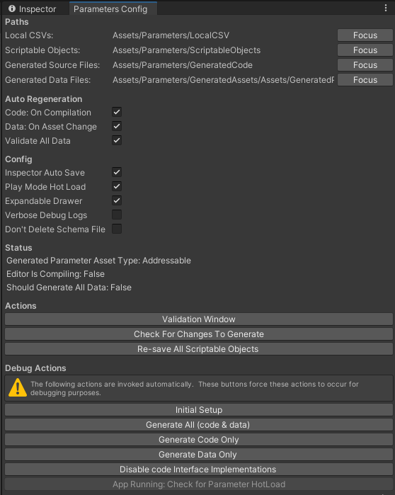

# Trouble Shooting <!-- omit in toc -->

## Debug Config Panel

The entry point to the debug config panel for the package is through the menu `Pocket Gems`
-> `Parameters` -> `Config Panel`.

**Paths**
- `Local CSVs`: Location where all CSV data files are located.
- `Scriptable Objects`: Recommended location for Scriptable Objects to be organized under.
- `Generated Source Files`: Folder that holds all editor & runtime generated code.
- `Generated Data Files`: The generated optimized data file(s) that are used at runtime by the app.

**Auto Regeneration**
These are config toggles that should be left on.
- `Code: On Compilation`: Detection of code changes and generating code from them.
- `Data: On Asset Change`: Detection of asset changes (on import) and auto generates the flat buffer data file from them.
- `Validate All Data`: Upon code or asset change, run validation against all data to verify integrity. 

**Config**
- `Inspector Auto Save`: Periodically saves Scriptable Objects when modified in the inspector.
- `Play Mode Hot Load`: Allows auto hot loading FlatBuffer data during runtime on Scriptable Object changes.
- `Expandable Drawer`: Enable/Disables capability to expand the `ParameterReference` inspector drawer (in case of bug/crash).
- `Verbose Debug Logs`: Logs all engineering debug data to the console. This is only needed to help an engineer debug code issues (either on their machine or others) and can be left off most of the time.
- `Don't Delete Schema File`: Toggle to leave the schema file utilized to create the falt buffer source files (for debugging purposes).

**Status**
- `Generated Parameter Asset Type`: Informs if the generated asset will be a `Resource` or `Addressable Asset`.
- `Editor Is Compiling`: Informing the user if the editor is currently compiling.
- `Should Generate All Data`: True if the system will auto re-generate all data.

**Actions**
- `Validation Window`: Opens the validation window.
- `Check For Changes To Generate`: Re-checks the assemblies to see if code needs to be re-generated.
- `Re-save All Scrtipable Objects`: Does a project wide asset save.

**Debug Actions**
- `Initial Setup`: Used once to force initially setup the folder structure from scratch with example files.
- `Generate All (code & data)`: Force generate all source files and generate the needed data file for runtime usage.
- `Generate Source Files`: Force generate all source files only.
- `Generate Data`: Force read all Scriptable Objects and re-generate the FlatBuffer data file.
- `Disable code Interface Implementations`: Changes code so that none of the defined classes are attempting to implement the intefaces and workaround compiler errors.
- `App Running: Check for Parameter HotLoad`: If the editor app is running, attempts to save changed assets and HotLoad changed parameter data.

## Duplicate DLLs
This package incoorporates 4 DLLs:
- `Editor/Plugins/csvhelper-netstandard2.1/CsvHelper.dll`
- `Editor/Plugins/Scriban.4.0.1/netstandard2.0/Scriban.dll`
- `Tests/Plugins/Castle.Core.4.4.1/lib/netstandard1.5/Castle.Core.dll`
- `Tests/Plugins/NSubstitute4.4.0/lib/netstandard1.3/NSubstitute.dll`

In cases where there are conflicts with pre-existing DLLs, these package DLLs can be excluded with [Scripting Symbols](https://docs.unity3d.com/Manual/CustomScriptingSymbols.html).

To exclude the DLLs under the `Editor` folder, define the symbol: `EXCLUDE_PARAM_EDITOR_DLLS`.

To exclude the DLLs under the `Tests` folder, define the symbol: `EXCLUDE_PARAM_TEST_DLLS`.